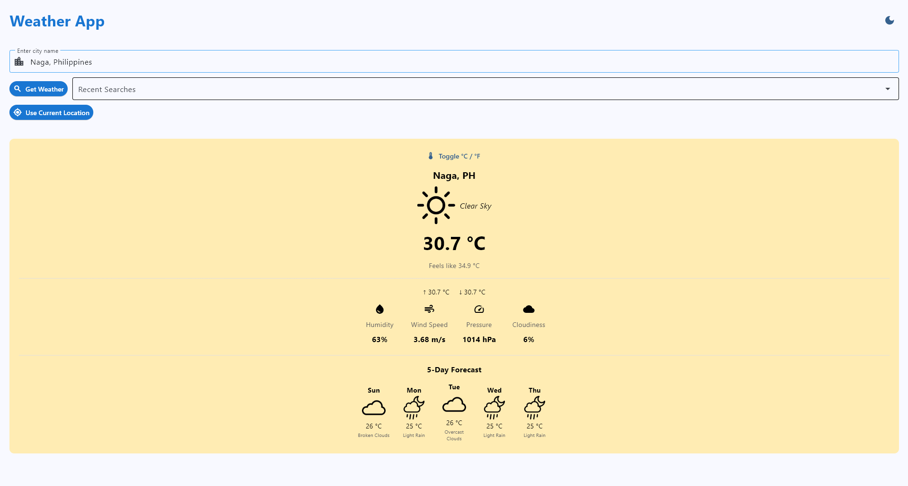
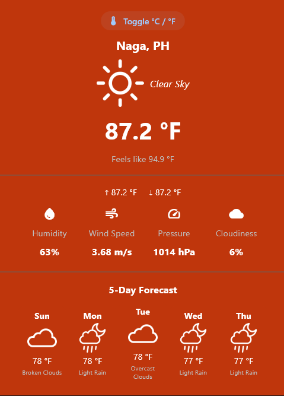
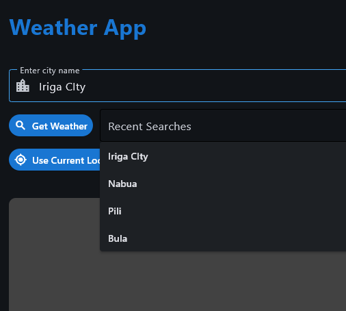

# Weather Application - Module 6 Lab

## Student Information
- **Name**: Marc Justin N. Prestado
- **Student ID**: 231002290
- **Course**: CCCS 106
- **Section**: BSCS 3A

## Project Overview
A Weather App built in Python using Flet. Weather provided by OpenWeather through API.

## Features Implemented

### Base Features
- [x] City search functionality
- [x] Current weather display
- [x] Temperature, humidity, wind speed
- [x] Weather icons
- [x] Error handling
- [x] Modern UI with Material Design

### Enhanced Features
1. **Theme Toggle**
   - Switches between Light theme and Dark theme
   - To provide a user-friendly interface that caters to different environments and preferences
   - Detecting the user’s system theme preference (light/dark) was tricky, since default differently across devices. Needed to take account that initial state before allowing manual toggles to avoid inverted colors (backgounds, icons and texts)

2. **Metric to Imperial Temperature Toggle**
   - Converts the temperature to metric or imperial (C/F)
   - To enhance user experience and accessibility by allowing users to view information in the system they are most familiar with
   - Auto-refreshing weather data caused Celsius-to-Fahrenheit conversions to mislabel values. A dedicated conversion function outside the display logic resolved the issue.

3. **Search History**
   - Stores and displays previously searched locations for quick access
   - To reduce user effort and improve navigation by eliminating repetitive searches
   - Browser storage (localStorage) had to be carefully managed to avoid clutter and ensure data persistence across sessions without impacting performance

4. **User Location Button & Preload**
   - Automatically detects and loads the user's current location on app load
   - To provide an instant, personalized experience without requiring manual input
   - Geolocation API permissions and async timing created race conditions — solved by implementing a loading state and graceful fallback to manual search if location access is denied or delayed

5. **Dynamic Display Background Color Based on Weather**
   - Changes the background color and gradient dynamically based on current weather conditions (e.g., blue for rain, orange for sunset, gray for clouds)
   - To create an immersive, emotionally resonant experience that visually reflects the weather
   - Mapping weather codes to color palettes required fine-tuning for edge cases (e.g., "partly cloudy" vs "mostly sunny") and ensuring contrast remained readable with text and icons

6. **Customized Weather Icon / Logo**
   - The weather icon identifier that can be seen throughout the app
   - To maintain visual harmony and brand consistency regardless of user preference
   - Logo assets found were exclusive for dark theme, used a recoloring python program that fills the image (PNG) with inverted color
  
## Screenshots





## Installation

### Prerequisites
- Python 3.8 or higher
- pip package manager

### Setup Instructions
```bash
# Clone the repository
git clone https://github.com/<username>/cccs106-projects.git
cd cccs106-projects/mod6_labs

# Create virtual environment
python -m venv venv
source venv/bin/activate  # On Windows: venv\Scripts\activate

# Install dependencies
pip install -r requirements.txt

# Create .env file
cp .env.example .env
# Add your OpenWeatherMap API key to .env


