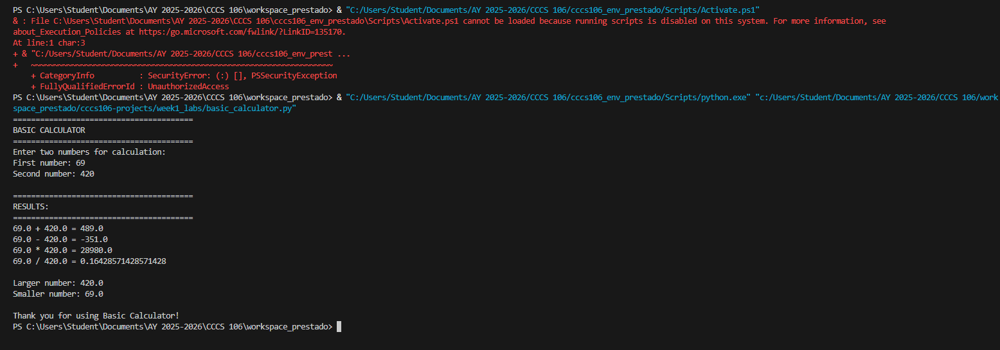
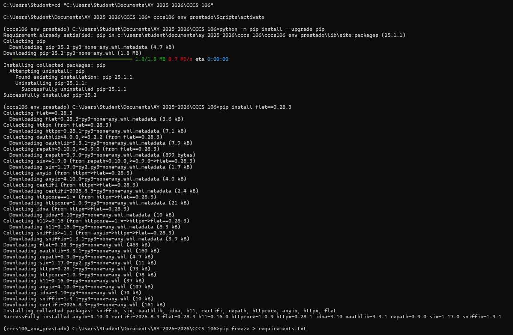
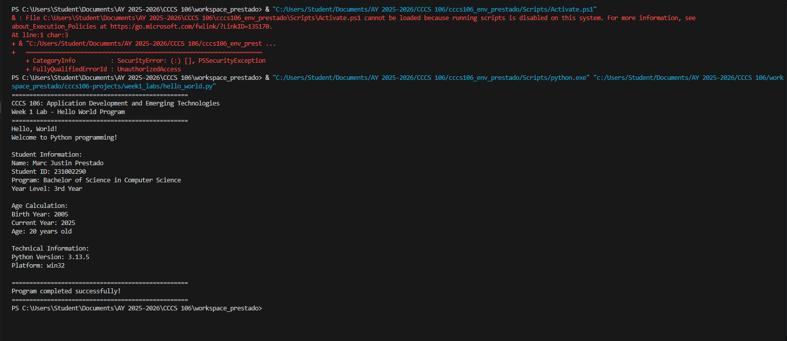
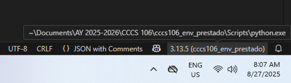

# Lab 1 Report: Environment Setup and Python Basics

**Student Name:** Marc Justin N. Prestado
**Student ID:** 231002290
**Section:** BSCS 3A
**Date:** 8/27/2025

## Environment Setup

### Python Installation
- **Python Version:** 3.13.5
- **Installation Issues:** Simple syntax errors, difficulties in tracing directories
- **Virtual Environment Created:** ✅ cccs106_env_prestado

### VS Code Configuration
- **VS Code Version:** 1.103.2
- **Python Extension:** ✅ Installed and configured
- **Interpreter:** ✅ Set to cccs106_env_prestado/Scripts/python.exe

### Package Installation
- **Flet Version:** 0.28.3
- **Other Packages:** 
    anyio==4.10.0
    h11==0.16.0
    httpcore==1.0.9
    httpx==0.28.1
    idna==3.10
    oauthlib==3.3.1
    repath==0.9.0
    six==1.17.0
    sniffio==1.3.1

## Programs Created

### 1. hello_world.py
- **Status:** ✅ Completed
- **Features:** Student info display, age calculation, system info
- **Notes:** Calculation does not account on accurate birthdays

### 2. basic_calculator.py
- **Status:** ✅ Completed
- **Features:** Basic arithmetic, error handling, min/max calculation
- **Notes:** Simple and elegant command line calculator. Nothing more, nothing less

## Challenges and Solutions

Encountered extension errors and interpreter setups. Paying accurate attention to small details eliminated said errors.

## Learning Outcomes

I learned to more delicately use python using multiple applications using command line interface, Visual Studio code integration and Virtual environment initialization and usage.

## Screenshots

 
 
 
